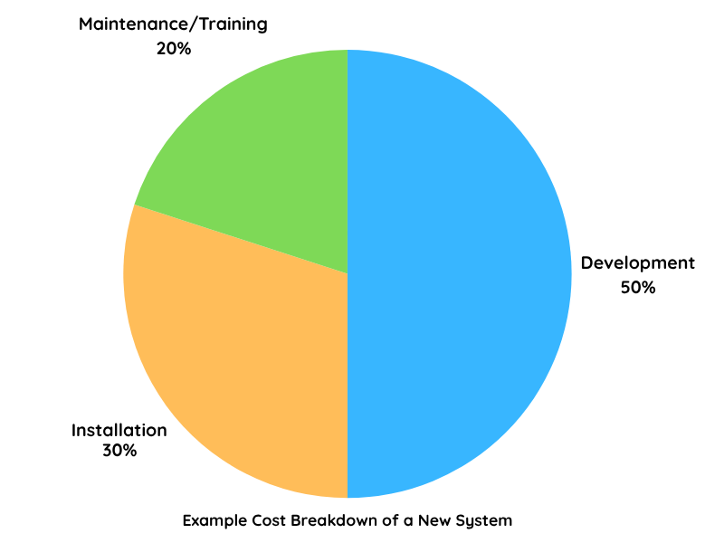
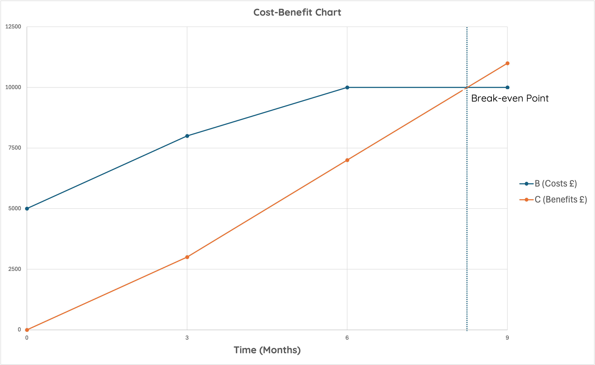

# Feasibility Studies

!!! info "What you Need to Know"

    Describe, exemplify, and implement research for:
 
    * feasibility studies:
        * economic
        * time
        * legal
        * technical
        * user surveys

Before starting a new system, it’s important to decide if it’s worth the time and money. 

This is where a __feasibility study__ comes in as it helps determine:

* Is the project realistic?
* Can it be achieved within time and budget?
* Will it meet the goals set in the __problem definition__?

A feasibility study should:

* Be low-cost and quick to complete

* Involve __no legal commitment__ to proceed

* Suggest __options or alternatives__

* End with a clear report for the client, showing:
    * Costs
    * Benefits
    * Possible solutions
    * Recommendations

!!! info "Key Points"
    
    * The feasibility study should be conducted relatively cheaply and within a fairly short time frame. 
    
    * There are no legal or contractual requirements at this stage.
    
    * The findings of the feasibility study are presented to the client in the form of a report.
    
    * This report indicates costs, benefits, alternatives and appropriate recommendations.

## Feasibility Studies

A feasibility study should look at the following five main areas:

### Economic Feasibility

!!! info "💷 What is Economic Feasibility?"

    Economic Feasibility deals with the cost implications involved. 
    
    Management will want to know how much each option will cost, what is affordable within the company’s budget and what they get for their money.

    Economic feasibility asks: 
    
    :   __Can we afford this system, and is it worth it?__

    A system is economically feasible if:

    :   * Its __benefits outweigh the costs__

        * It reaches __break-even__ within a realistic timeframe
    
    __Example__:  

    :   A school wants a new timetable system. If the software costs £10,000 but saves £15,000 in admin time over a year, then it’s economically feasible.

#### Cost-Benefit Analysis
A cost-benefit-analysis is part of the budgetary feasibility study. 
    
If the project is not cost-effective then there is no point proceeding. Setting up a new computer system is an investment and involves capital outlay. 
    
The costs of a new system include:
    
* the costs of acquiring it in the first place (consultancy fees, program development including cost of any resources required for development, etc.)
    
* the costs of installing it (disruption of current operations, cost of new equipment, alteration of workplace, etc.)
    
* the costs of maintaining it which also includes training. 
<figure markdown="span">
{ width="600" }
</figure>
    
In the long term, management will also want to know the ‘break-even point’ when the new system stops costing money and starts to make money. 

<figure markdown="span">

</figure>

!!! warning "Economic Feasibility is Difficult to Estimate"

    It's often difficult to accurately calculate future costs and benefits.

    Estimations depend heavily on the __expertise and experience of the systems analyst__.
	
Once the system begins to generate value, it's important to distinguish the types of benefits it brings. These can be divided into two categories: tangible(__something you can see, touch, or easily quantify__) and intangible(__something that is not easily measured or quantified__).

Benefits generated by a system can be tangible or intangible, as shown below: 

| Tangible Benefits         | Intangible Benefits         |
|--------------------------|-----------------------------|
| Reduced running costs     | Improved staff morale       |
| Increased operational speed| Better customer perception |
| Increased throughput      | Easier communication        |
| Better reporting facilities| Increased job satisfaction |

🚨 Note: __Not all the costs and benefits lend themselves to direct measurement__. 

!!! info "Key Points"
	    
    * The client will want to know the cost of each option and what they get for their money.
		
    *  A system is only economically feasible if the benefits of the development outweigh the costs. For this reason a cost benefit analysis is carried out.

### Time Feasibility

!!! info "⏱️ What is Time Feasibility?"

    __Time feasibility asks__:  
    :   Can the system be developed and implemented within the available time, and will it be ready when it is needed?

    __It considers__:

    :   The time needed for development, installation, and training

        The effect on the client’s schedule or operations

    __Example__

    :   A school wants to install a new report-writing system in time for the October break. If development, testing, and training will take 4 months and it’s already July, the project may __not be time feasible__.

If the project can be completed __within a realistic timeframe__ and without disrupting important business operations, it is considered __time feasible__.

#### Factors That Affect Time Feasibility

- Total time required for system development  
- Client’s calendar — busy periods, deadlines, seasonal events  
- When installation and training can take place  
- When the system must be fully operational  
- Availability of staff and resources  

#### Questions to Ask

- How long will the system take to develop?
- When is the least disruptive time to install it?
- Will it be ready by the required date?

🚨 Note: A system can be __technically__ and __economically__ feasible but __still not time feasible__ if it won’t be finished in time to be useful. Delays can make the system pointless or even harmful to the organisation.

!!! info "Key Points"
	    
    * Time feasibility focuses on __scheduling and deadlines__
		
    *  A system must be ready __when the client needs it__.

    *  Development, training, and installation must fit within the timeline.

    *  Failing to meet the deadline can make the system __unusable__, even if it works perfectly

### Legal Feasibility

Legal feasibility is about ensuring the proposed system complies with all relevant laws and regulations. Organisations must assess any legal risks that may arise from developing, deploying, or using the system.
    
!!! abstract "⚖️ What is Legal Feasibility?"

    Legal feasibility considers whether the new system complies with relevant laws and regulations, including:

    - **Contracts and liability:** Will the system change responsibilities under existing contracts?
    - **Health and safety:** Will it meet workplace and digital safety standards?
    - **Data protection laws (e.g. GDPR):** Will it handle personal data legally and securely?
    - **International regulations:** Will it comply with laws in other countries where users or data may reside (e.g. EU, USA)?
    - **Software licensing:** Are appropriate licenses available and affordable?

!!! info "Software Licensing Considerations"

    Software licensing can be complex and must be carefully checked. The organisation must ensure that:
    
    - The right type of licence is used:
      - **Client licence (per seat)**
      - **Server licence**
      - **Network licence**
      - **Site licence**

    - The licence duration is appropriate:
      - **Annual subscription**
      - **Perpetual (one-off) purchase**

    Different vendors have different rules, so licensing terms should be verified before proceeding.

### Technical Feasibility

Technical feasibility examines whether the proposed system can be developed and implemented using available technology, hardware, and expertise. It helps identify whether the organisation has the technical capability or needs additional resources.

!!! abstract "🖥️ What is Technical Feasibility?"

    Technical feasibility assesses whether the system can be built and run using the organisation’s current or accessible technology. It includes:

    - **Required hardware and software**: Are the necessary tools available or affordable?
    - **Technical skills**: Do staff or developers have the expertise to implement and maintain the system?
    - **Integration**: Can the new system work with existing systems?
    - **Support and maintenance**: Are updates, patches, and technical support available?
    - **Hardware specifications**: Are existing devices powerful enough?
    - **Network capacity**: Can the network cope with the new system?
    - **Storage requirements**: Is sufficient storage available?
    - **Software compatibility**: Will the new system work with existing software?

!!! info "Example"

    If a school wants to run a new multimedia learning platform but only has outdated computers, the system may not be technically feasible unless upgrades are made.

### User Surveys

In addition to the feasibility study, surveys and questionnaires help gather feedback from users, especially when many opinions are needed. This helps ensure the system meets real needs.

!!! abstract "📋 What is a User Study?"

    User feasibility ensures that the proposed solution aligns with user expectations and requirements, which is essential for the project's success. It helps determine:
    
    - **User needs**: Will the system actually solve the users’ problems?
    - **Ease of use**: Is the system user-friendly and intuitive?
    - **User acceptance**: Are users willing to adopt the system?
    - **Usability challenges**: Are there barriers that could prevent adoption?

    Here's why user feasibility is important:
    - It **identifies potential roadblocks** early, such as usability issues or resistance to change, allowing adjustments to the design or implementation plan.
    - It ensures the project **addresses real user needs**, increasing its relevance and value.
    - It improves the overall **user experience** by considering preferences and behaviours.
    - It **increases adoption rates** – if users find the system easy to use and beneficial, they're more likely to embrace it.

    In short, user feasibility isn't just a nice-to-have – it's essential for determining whether a project is practical, usable, and likely to succeed.

> For example, a new library system would be developed following some time spent capturing the experience of existing librarians and how they operate.

#### Methods of Gathering User Information

Common methods include:

* Questionnaires and surveys
* Interviews
* Observation
* Focus groups

Different methods provide different types of information and are often used together during a feasibility study.

The users of a particular program are often best placed to identify problems and suggest improvements based on real experience. If the system is brand new, the target user group should still understand the domain well enough to provide useful input.

When the opinion of a number of users is required, it is often easier to create a survey or questionnaire which will capture the information that the project team require.

**Example**:  
A college developing a new library system might survey librarians to ask what features they need most.

## Summary of Feasibility Studies

| Feasibility Type | Main Question |
|------------------|--------------|
| Economic | Can we afford it? |
| Time | Can it be completed on time? |
| Legal | Does it comply with the law? |
| Technical | Do we have the technology and expertise? |
| User Surveys | Do users want and support the solution? |
