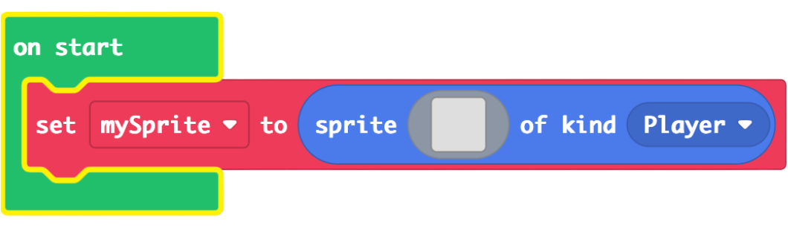
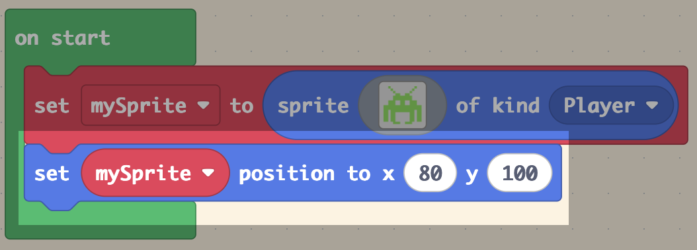
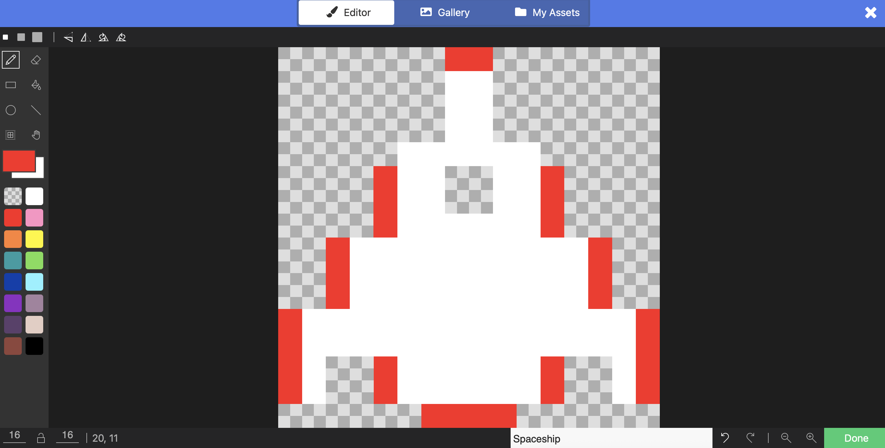
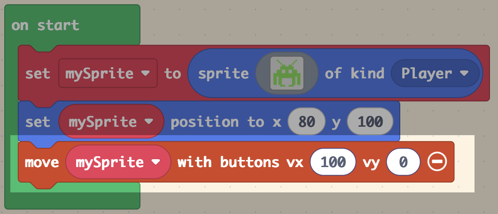
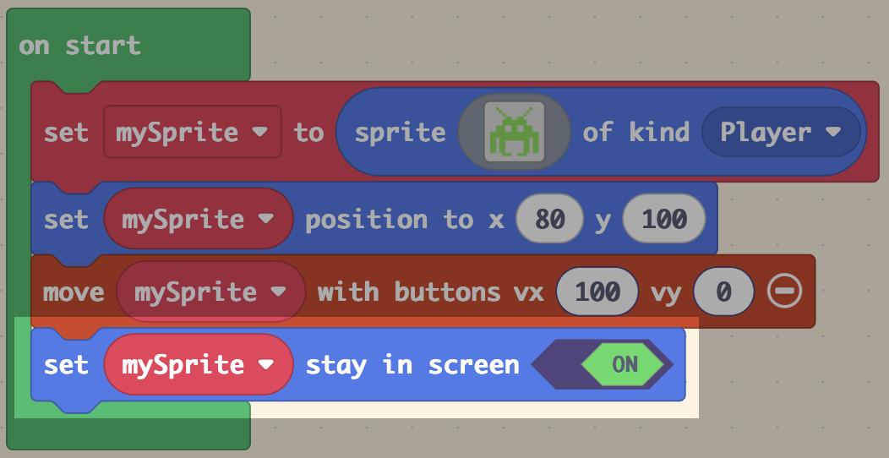
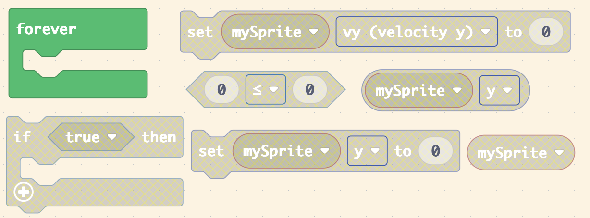

# Slide 1: Space Invaders Lesson 1 - Player Setup

- Learning Intention: Build a controllable player spaceship.
- E&Os: `TCH 3-15a`, `TCH 3-13a`
- Benchmarks focus: selecting tools, building and testing a simple control system.

# Slide 2: Success Criteria

- I can create a player sprite.
- I can position it at the bottom of the screen.
- I can move it left and right with controls.
- I can keep it inside the screen.

# Slide 3: Starter / Retrieval

- What is a sprite in MakeCode Arcade?
- Which block controls movement with buttons?
- Why might we keep `vy` at `0` in this lesson?

# Slide 4: Teacher Demo - Create the Player

- Add `set mySprite to sprite of kind Player`.
- Draw a 16x16 ship sprite.
- Place sprite at `x: 80 y: 100`.

# Slide 5: Teacher Demo - Add Movement Rules

- Use `move mySprite with buttons`.
- Set `vx: 100` and `vy: 0`.
- Turn `mySprite stay in screen` to ON.

# Slide 6: Build Checkpoint

- Run game.
- Confirm ship moves left/right only.
- Confirm ship cannot leave screen.
- Debug if needed: sprite kind, position, and movement values.

# Slide 7: Level 1-4 Task Choices

- Level 1: Follow guided steps to create and position the player.
- Level 2: Add movement and screen-boundary behaviour with one hint card.
- Level 3: Allow diagonal movement, then constrain playable area to lower screen.
- Level 4: Build a mini start sequence (`splash` + short instructions) and justify movement speed choices.

# Slide 8: Plenary / Exit Question

- Which block had the biggest impact on gameplay feel: speed, start position, or stay-in-screen?
- Explain one test you used to confirm your code worked.

# Slide 9: Homework / Extension

- Redesign the player sprite with a clear hitbox.
- Write 3 bullet points on how controls affect user experience.

# Slide 1: Space Invaders Lesson 1 - Player Setup

- Learning Intention: Build a controllable player spaceship using sprites and movement controls.
- E&Os: `TCH 3-15a`, `TCH 3-13a`
- Benchmarks focus:
  - Selecting appropriate development tools.
  - Building and testing a simple control system.
  - Understanding how player input changes a game.

## Lesson Overview

In this lesson pupils will:

- Create their first player sprite.
- Learn how sprites represent game objects.
- Add movement controls using buttons.
- Test and debug movement behaviour.
- Explore how game controls affect gameplay.

## Key Vocabulary

- Sprite
- Player
- Coordinates
- Velocity
- Debugging
- Input

# Slide 2: Success Criteria

## By the end of the lesson I can:

- Create a player sprite.
- Position a sprite using coordinates.
- Move the sprite left and right with controls.
- Prevent the sprite leaving the screen.
- Test and debug simple movement code.

## Teacher Discussion

Ask pupils:

- Why would a game need movement limits?
- What would happen if the player could leave the screen?
- Why do many games start with simple movement first?

# Slide 3: Starter / Retrieval

## Retrieval Questions

- What is a sprite in MakeCode Arcade?
- Which block controls movement with buttons?
- Why might we keep `vy` at `0` in this lesson?
- What does the `Player` kind mean?

## Pair Discussion

Discuss with a partner:

- Which games use sprites?
- What makes controls feel smooth or frustrating?

## Teacher Notes

Reinforce:

- Sprites are game objects.
- Coordinates control position.
- Velocity controls movement speed.
- `vy = 0` stops vertical movement.

# Slide 4: Teacher Demo - Create the Player

## Step-by-Step Demo

1. Open the `Sprites` menu.
2. Add `set mySprite to sprite of kind Player`.
3. Click the grey square to draw a sprite.
4. Create a simple 16x16 spaceship.
5. Rename the variable if required.
6. Place the sprite at `x: 80 y: 100`.

## Explain to Pupils

- `x` controls horizontal position.
- `y` controls vertical position.
- The centre of the screen is roughly `x:80`.
- Larger `y` values move the sprite lower.

## Question Prompt

- Why do we place the player near the bottom of the screen in Space Invaders?

# Slide 5: Teacher Demo - Add Movement Rules

## Add Player Controls

- Use `move mySprite with buttons`.
- Set `vx: 100`.
- Set `vy: 0`.
- Turn `mySprite stay in screen` to ON.

## Explain the Code

- `vx` means horizontal speed.
- `vy` means vertical speed.
- Positive and negative values control direction.
- `stay in screen` prevents the sprite leaving the game area.

## Live Testing

Demonstrate:

- What happens when `vy` changes.
- What happens if `stay in screen` is OFF.
- Different movement speeds.

## Mini Challenge

Ask pupils:

- Which speed feels best for gameplay?

# Slide 6: Build Checkpoint

## Checklist

- Run the game.
- Confirm the ship moves left and right.
- Confirm the ship does not move vertically.
- Confirm the sprite cannot leave the screen.
- Test movement speed.
- Debug any problems.

## Common Errors

| Problem | Possible Cause |
|---|---|
| Sprite will not move | Missing movement block |
| Sprite moves vertically | `vy` not set to `0` |
| Sprite disappears | `stay in screen` not enabled |
| Wrong sprite moves | Incorrect sprite variable |

## Teacher Prompt

- How do programmers test games while building them?

# Slide 7: Level 1-4 Task Choices

## Level 1

- Follow guided steps.
- Create and position the player sprite.

## Level 2

- Add movement controls independently.
- Enable `stay in screen`.
- Use one hint card if needed.

## Level 3

- Experiment with diagonal movement.
- Restrict the player to the lower screen area.
- Compare different movement speeds.

## Level 4

- Create a mini start sequence using `splash`.
- Add short instructions.
- Justify movement speed choices.
- Design an improved spaceship sprite.

## Extension Questions

- Which movement style creates the best gameplay?
- Why is testing important in game development?

# Slide 8: Plenary / Exit Question

## Exit Questions

- Which block had the biggest impact on gameplay feel?
- Why is `stay in screen` useful?
- How did you test your game?
- Which part of the lesson was most challenging?

## Reflection Prompt

Complete the sentence:

- “Today I learned that…”

## Teacher Discussion

Highlight:

- Building games requires testing.
- Small code changes can greatly affect gameplay.
- Debugging is a normal part of programming.

# Slide 9: Homework / Extension

## Homework Task

- Redesign the player sprite.
- Create a more detailed spaceship.
- Keep the hitbox fair for gameplay.

## Written Reflection

Write 3 bullet points explaining:

- How controls affect user experience.
- Why movement speed matters.
- Why testing is important in games.

## Optional Extension

Research:

- What were sprites used for in older arcade games?
- How are modern game characters different from sprites?