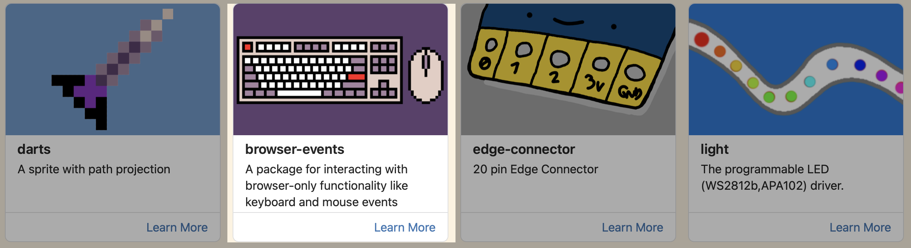
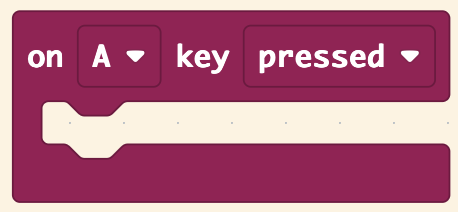
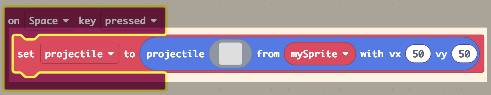
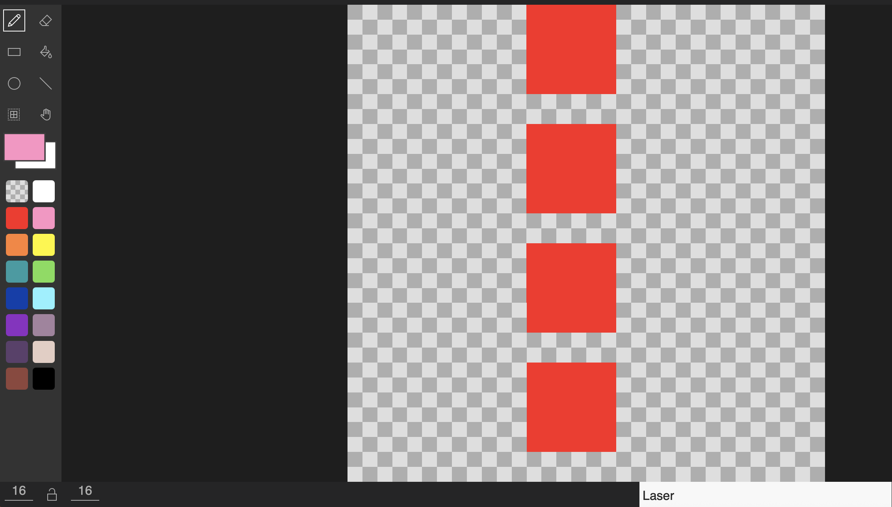
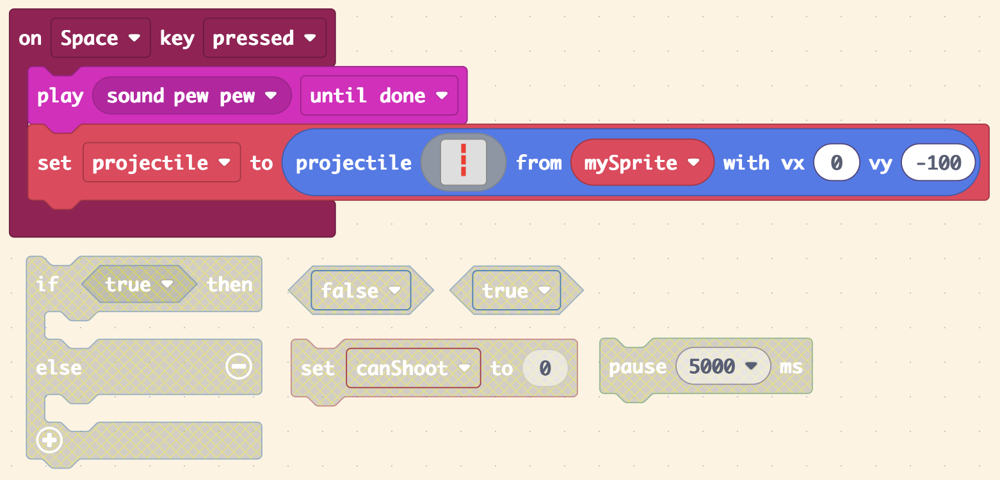

# Slide 1: Space Invaders Lesson 2 - Shooting Lasers

- Learning Intention: Make the player fire projectiles.
- E&Os: `TCH 3-15a`, `TCH 3-14a`
- Benchmarks focus: event handling and variable use in game code.

# Slide 2: Success Criteria

- I can use a key-press event.
- I can create a laser projectile from my player sprite.
- I can set projectile direction and speed.
- I can test repeated firing.

# Slide 3: Starter / Retrieval

- What does an event block do?
- Why is laser `vy` negative?
- Which variable stores the projectile?

# Slide 4: Teacher Demo - Inputs and Variables

- Add Browser Events extension.
- Use `on Space key pressed`.
- Create variable `Laser`.

# Slide 5: Teacher Demo - Projectile Build

- Add projectile block in the event.
- Set `vx: 0` and `vy: -100`.
- Draw the laser sprite.

# Slide 6: Build Checkpoint

- Press Space to fire.
- Confirm laser spawns from player position.
- Confirm laser moves upward.

# Slide 7: Level 1-4 Task Choices

- Level 1: Build the exact guided space-to-laser behaviour.
- Level 2: Add firing sound and test different sound effects.
- Level 3: Add anti-spam delay using `canShoot` and pause logic.
- Level 4: Implement cooldown feedback (message, effect, or sound shift) and explain why it improves game balance.

# Slide 8: Plenary / Exit Question

- How does event-driven code differ from code in `on start`?
- What one test proves your cooldown works?

# Slide 9: Homework / Extension

- Create 2 laser designs (normal and upgraded).
- Note which one is easier for players to track and why.
