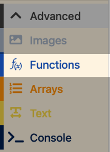
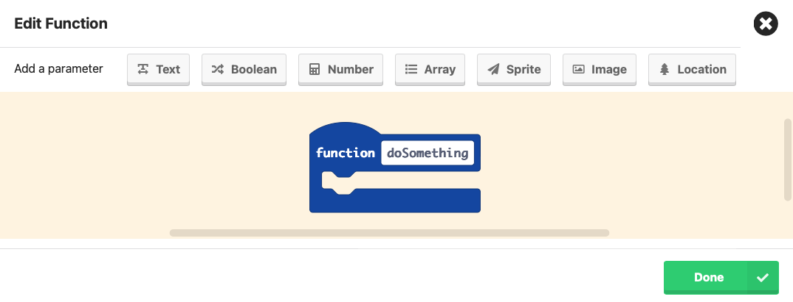
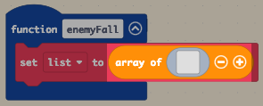
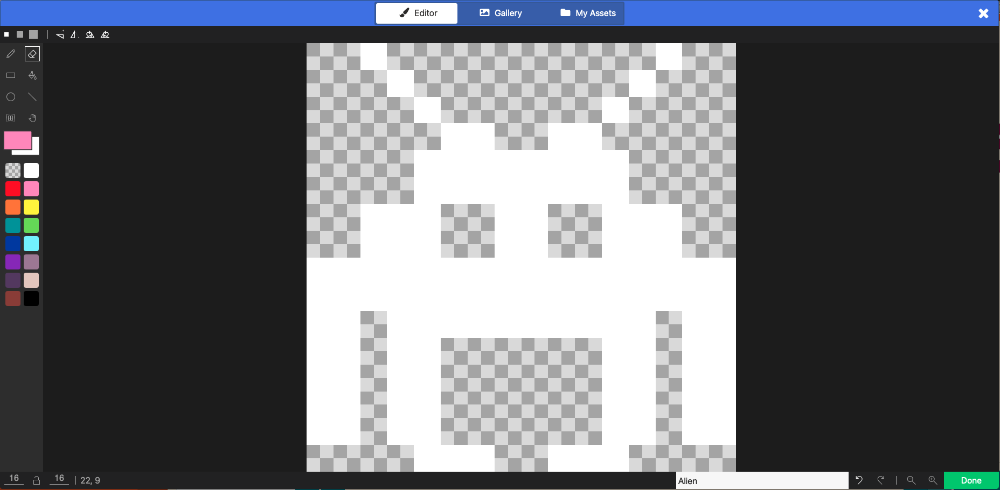

# Slide 1: Space Invaders Lesson 3 - Adding Enemies

- Learning Intention: Design enemy sprites and store them for reuse.
- E&Os: `TCH 3-15a`, `TCH 3-14a`, `TCH 3-13b`
- Benchmarks focus: structured information (arrays) and modelling system elements.

# Slide 2: Success Criteria

- I can create an `enemyFall` function.
- I can store enemy sprite images in an array.
- I can explain why arrays help game design.

# Slide 3: Starter / Retrieval

- What is the difference between a variable and an array?
- Why put repeated logic in a function?

# Slide 4: Teacher Demo - Function Setup

- Make `enemyFall` function.
- Create `randomEnemyArray` variable.
- Add array block inside the function.

# Slide 5: Teacher Demo - Build Enemy Array

- Add first enemy sprite image into array slot.
- Add more slots with `+`.
- Draw varied alien designs.

# Slide 6: Build Checkpoint

- Confirm array exists and has multiple enemies.
- Confirm function is named clearly and ready for next lesson.

# Slide 7: Level 1-4 Task Choices

- Level 1: Create `enemyFall` and one enemy in `randomEnemyArray`.
- Level 2: Add at least three enemies with clear visual differences.
- Level 3: Add a second array for bonus enemies and justify one design choice.
- Level 4: Build enemy categories (normal/fast/tough concept art) and annotate how each will affect gameplay.

# Slide 8: Plenary / Exit Question

- Why is an array a better choice than separate single variables for enemies?

# Slide 9: Homework / Extension

- Design 3 themed enemy sprites and label which level they belong to.
