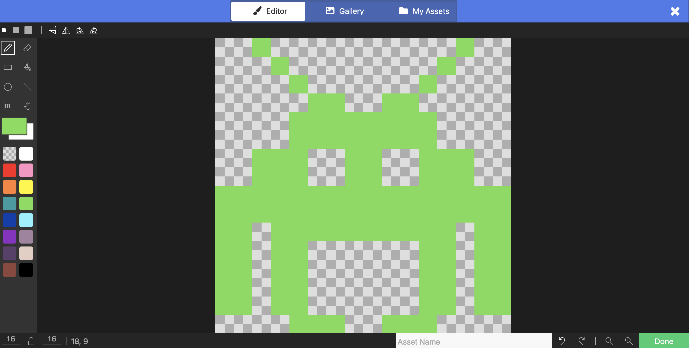

# Slide 1: Space Invaders Lesson 4 - Destroying Enemies

- Learning Intention: Detect collisions and apply outcomes.
- E&Os: `TCH 3-15a`, `TCH 3-14a`
- Benchmarks focus: conditional behaviour and event outcomes.

# Slide 2: Success Criteria

- I can detect laser-enemy overlap.
- I can destroy the enemy sprite on hit.
- I can increase score correctly.
- I can test collision reliability.

# Slide 3: Starter / Retrieval

- What is a sprite kind and why does it matter for overlaps?
- When should score increase in a shooter game?

# Slide 4: Teacher Demo - Overlap Event

- Add `on projectile overlaps otherSprite of kind Enemy`.
- Destroy enemy.
- Optionally destroy projectile.
- Add `info.changeScoreBy(1)`.

# Slide 5: Teacher Demo - Visual Feedback

- Add hit effect (spray/fire/confetti short effect).
- Add sound for hit confirmation.
- Keep effect brief to avoid lag.

# Slide 6: Build Checkpoint

- Hit test across left, centre, and right lanes.
- Confirm each hit removes one enemy and increments score by 1.
- Confirm misses do not increase score.

# Slide 7: Level 1-4 Task Choices

- Level 1: Build overlap event with destroy enemy only.
- Level 2: Add score increase and test 5 valid hits.
- Level 3: Add hit effect and ensure no double-counting from one projectile.
- Level 4: Award different scores for normal vs bonus enemies and explain your scoring balance.

# Slide 8: Plenary / Exit Question

- Which bug is more likely: missed collision or double scoring? Explain your test method.

# Slide 9: Homework / Extension

- Propose a scoring table (normal, bonus, rare enemy) with reasons.
