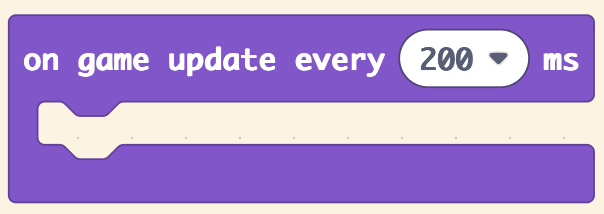
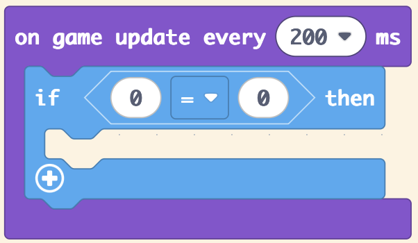
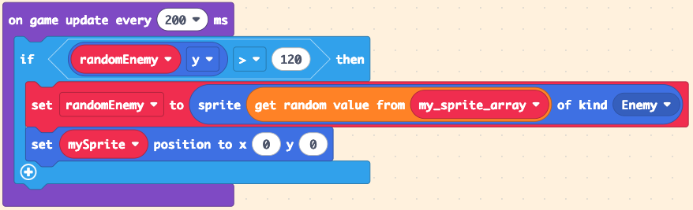

# Slide 1: Space Invaders Lesson 5 - Spawning Enemies

- Learning Intention: Spawn enemies over time in random positions.
- E&Os: `TCH 3-15a`, `TCH 3-13b`, `TCH 3-14a`
- Benchmarks focus: logic, randomisation, and timed updates.

# Slide 2: Success Criteria

- I can create enemies from an array.
- I can assign enemy kind and downward velocity.
- I can respawn or reposition enemies based on conditions.
- I can use timed updates.

# Slide 3: Starter / Retrieval

- Why use `pick random` in spawning?
- What condition tells us an enemy has left the screen?

# Slide 4: Teacher Demo - Create Random Enemy Sprite

- Create `randomEnemy` variable.
- Set sprite image from `get random value from randomEnemyArray`.
- Set kind to `Enemy`.

# Slide 5: Teacher Demo - Movement and Respawn Rules

- Set enemy `vy` (e.g., `60`).
- Use `on game update every 200 ms`.
- If enemy `y > 120`, reposition with random `x` and reset `y`.

# Slide 6: Build Checkpoint

- Enemies appear repeatedly.
- Enemies move top to bottom.
- Off-screen enemies are recycled correctly.

# Slide 7: Level 1-4 Task Choices

- Level 1: Build one timed spawn with one enemy image.
- Level 2: Spawn from array and ensure consistent downward motion.
- Level 3: Add spawn counter and show it in-game for testing.
- Level 4: Add adaptive spawn rate (faster over time) and justify pacing decisions.

# Slide 8: Plenary / Exit Question

- How do random selection and timed updates combine to create replay value?

# Slide 9: Homework / Extension

- Sketch a spawn difficulty curve for 60 seconds of gameplay.
