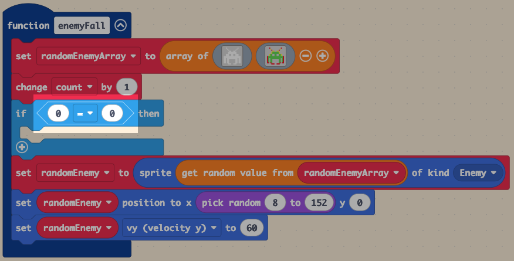
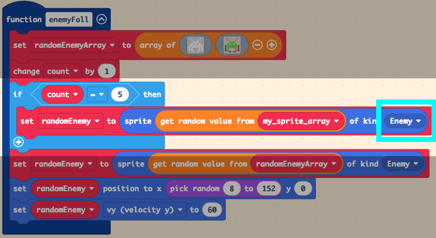
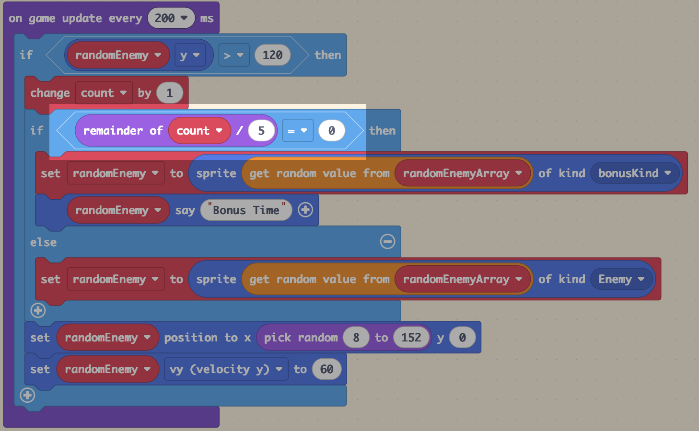

# Slide 1: Space Invaders Lesson 6 - Adding Bonus Enemies

- Learning Intention: Add conditional bonus events to gameplay.
- E&Os: `TCH 3-15a`, `TCH 3-13a`, `TCH 3-14a`
- Benchmarks focus: conditionals, counters, and outcome design.

# Slide 2: Success Criteria

- I can use a counter (`count`) in game logic.
- I can trigger bonus enemies under conditions.
- I can differentiate normal and bonus behaviour.

# Slide 3: Starter / Retrieval

- Why might we use a counter in an arcade game?
- What does modulo help us detect?

# Slide 4: Teacher Demo - Bonus Condition

- Add `if` condition after count changes.
- Check `count` milestone (e.g., 5).
- Spawn `bonusKind` enemy and mark it clearly.

# Slide 5: Teacher Demo - Make It Scalable

- Replace fixed milestones with modulo logic.
- Example: when `count % 5 == 0`, spawn bonus enemy.
- Keep normal enemy logic in `else`.

# Slide 6: Build Checkpoint

- Bonus event appears at expected intervals.
- Normal gameplay still works between bonus triggers.
- Bonus is visually distinct.

# Slide 7: Level 1-4 Task Choices

- Level 1: Trigger bonus at one fixed milestone.
- Level 2: Trigger bonuses at several milestones (5,10,15...).
- Level 3: Use modulo rule for recurring bonus spawn.
- Level 4: Add two bonus types with different effects and explain fairness.

# Slide 8: Plenary / Exit Question

- Why is modulo often better than many separate `if count = ...` checks?

# Slide 9: Homework / Extension

- Write one paragraph explaining bonus system design in your own game.
